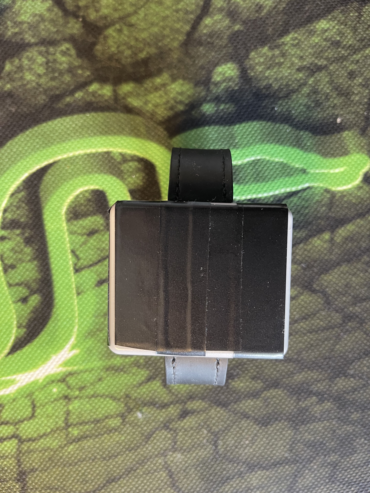
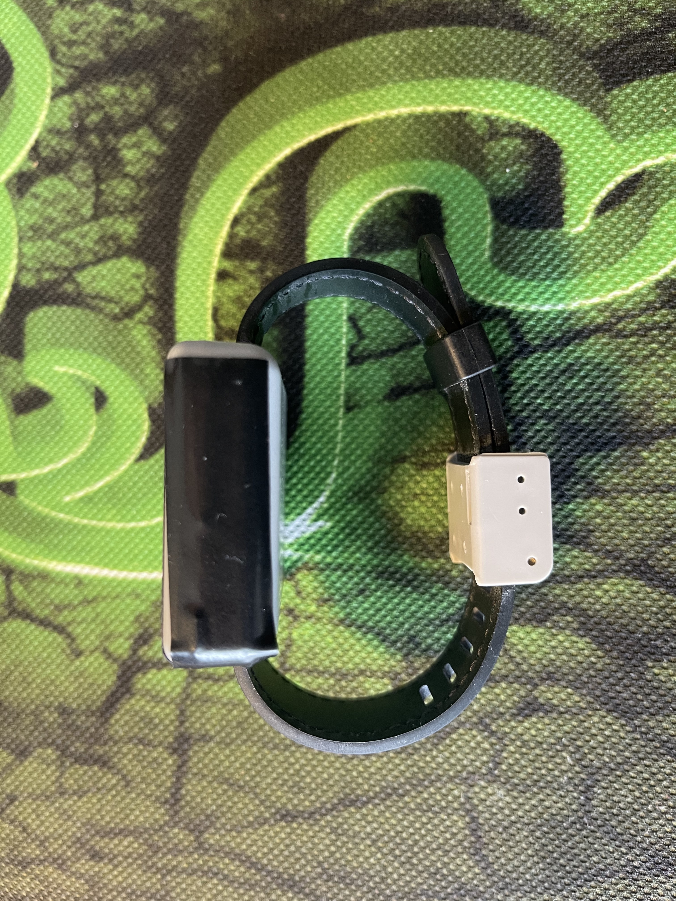
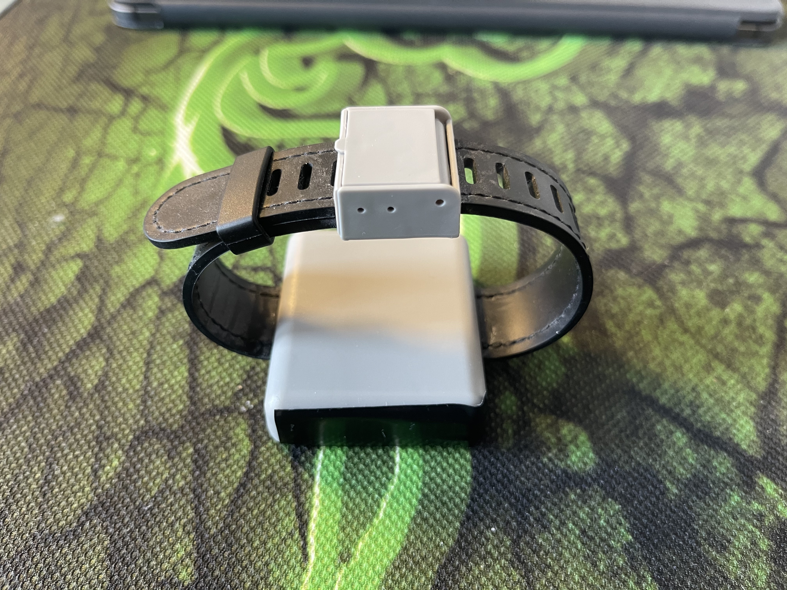
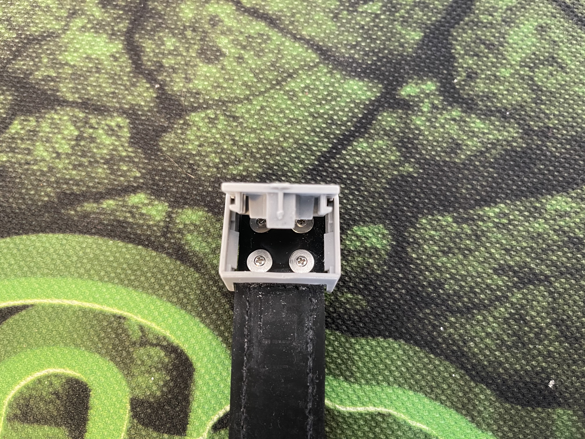

# QuarantineBoredom

## What is this?
This repo is the culmination of my quarantine in Hong Kong back in 2020. I was travelling through the city, but in order to be able to do that I had to undergo 14 days of alone time in a cozy hotel room. I had to keep myself sane somehow, so I decided to reverse engineer the protocol of the standard-issue tracking bracelet what was securely attached to my writst for the duration of my stay. 

## Why publish this?
Because it's cool. After the epidemic is over, I'll be able to look back and think about how terribe being stuck in a room for 14 days was. 

## Is this even remotely correct?
I have no clue. This was done just for fun and the values it spit out seemed to be at least partially correct. I could also see information the bracelets around me broadcasted, so it was good enoguh for me. 

## Can this research be abused?
Short answer: **no**

Long answer: Almost immedietally after I ended my quarantine, the bracelet being issued changed. I have no doubt that the protocol was changed and that was months ago already. By now, the only thing this research could be used for is sating curiosity. All this does is decode some information that is (was) there for everyone to see. 

## Pictures

